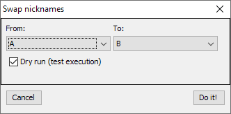
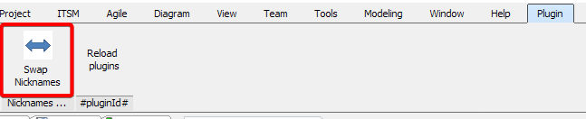
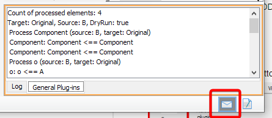

# Nicknames manager (Visual Paradigm plugin)
## What is it
Visual Paradigm's plugin which allows swap nicknames. Sometimes we make a mistake and
we write a name in the incorrect model language. For example, you think that works in
Original namespace, but really it was another. Manual transfer is boring and requires many-many mouse operations. 
This plugin can fix error in 3 clicks.

   

## How to install
1. Download a release with the plugin
2. Install then plugin into Visual Paradigm (Help - Install plugin)
3. Click on Export comments as DDL in context menu of ER Diagram

## How to use
1. Open diagram: Tab "Plugin, button Swap Nicknames"
   
2. In Swap nicknames dialog select nicknames, which you want to swap. Click "Do it!" and
take a coffee - operation is really long. If you want, you can click "Stop". The process will 
be stopped, but not immediately.

## Notes
1. Please, save a project before swap nicknames. Only one way cancel swapping is swap again.
2. You can see log in the Message toolbar (very useful in the Dry run mode)

   

3. No options select elements to swap nicknames, but you can:
    1. Create a new temporal diagram
    2. Make auxiliary views of required elements (simple copy-paste);
    3. Apply plugin on temporal diagram and delete that diagram.
